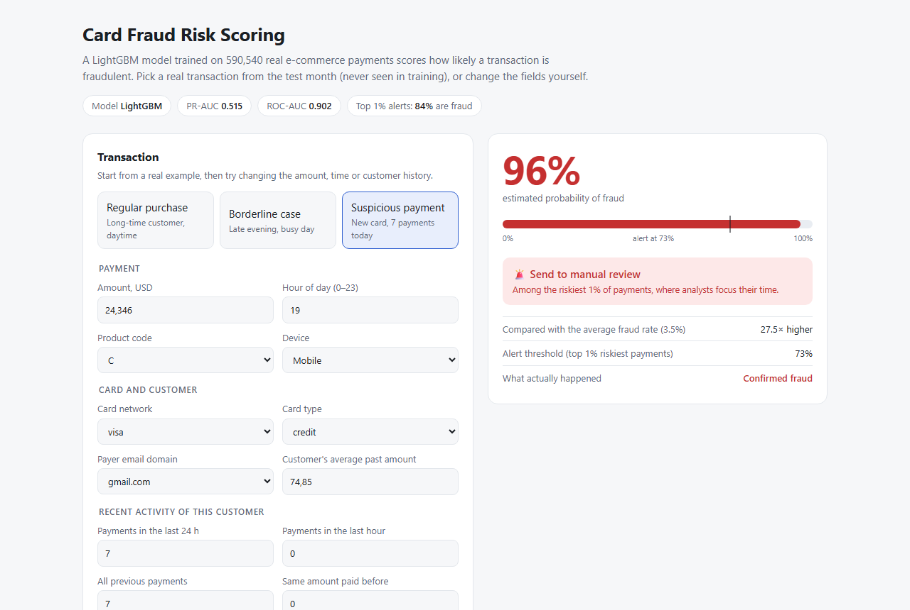
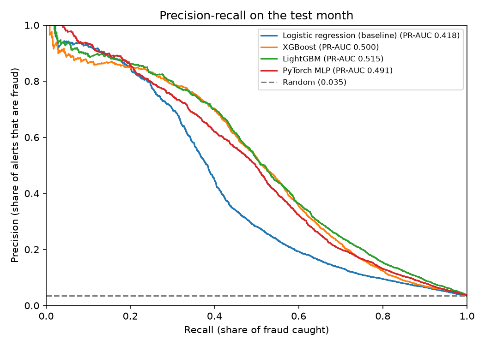
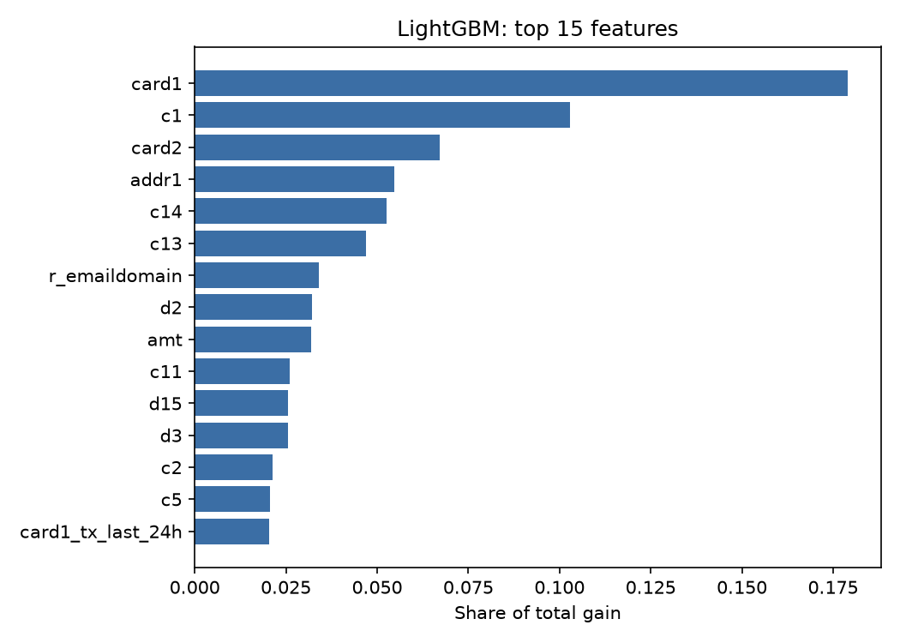

# Fraud Detection Pipeline: PostgreSQL → Feature Engineering → LightGBM vs PyTorch → Docker API

End-to-end machine-learning pipeline that flags fraudulent card transactions in
**590,540 real e-commerce payments** (IEEE-CIS / Vesta dataset, 3.5% fraud).
Raw data is loaded into PostgreSQL, behavioural features are built with SQL
window functions, gradient boosting is compared against a hand-written PyTorch
network, and the best model is served as a containerised REST API.

**▶ Live demo: [fraud-risk-demo.onrender.com](https://fraud-risk-demo.onrender.com)**: score real transactions in the browser (free hosting: the first request after a pause can take up to a minute while the service wakes up).

| | |
|---|---|
| **Best model** | LightGBM: **PR-AUC 0.515**, ROC-AUC 0.902 on a held-out future month |
| **Business view** | Reviewing the top 1% riskiest transactions catches **24% of all fraud** at **84% precision** |
| **Stack** | PostgreSQL · SQL window functions · pandas · XGBoost · LightGBM · PyTorch · FastAPI · Docker · Linux (WSL2/Ubuntu) |



*Interactive demo served by the same container at `/`: pick a real transaction from the test month or edit the fields, and the API returns the fraud probability and a review decision.*

**Skills shown:** SQL data modelling and window functions · leakage-free feature engineering ·
imbalanced classification · time-based validation · PyTorch (`nn.Module`, embeddings,
manual training loop) · REST API design · Docker · automated tests incl. training/serving parity.

---

## Results

Trained on months 1–4, early-stopped on month 5, reported on month 6 (never seen during training or tuning).

| Model | PR-AUC | ROC-AUC | Recall @ 1% alerts | Precision @ 1% alerts |
|---|---|---|---|---|
| Logistic regression (baseline) | 0.418 | 0.850 | 23.2% | 80.7% |
| XGBoost | 0.500 | 0.882 | 24.1% | 83.8% |
| **LightGBM** | **0.515** | **0.902** | **24.2%** | **84.1%** |
| PyTorch MLP (embeddings) | 0.491 | 0.886 | 23.3% | 81.2% |

Random guessing gives PR-AUC ≈ 0.035 (the fraud rate).



**Takeaways**
- **Gradient boosting wins on tabular data**, as it usually does: trees handle missing
  values, skewed amounts and high-cardinality IDs natively. The neural net needs
  log transforms, scaling, missing-value flags and embeddings to get close.
- The **PyTorch MLP is within 0.025 PR-AUC of LightGBM**: a reasonable candidate for an
  ensemble, since it makes different errors.
- **Why PR-AUC, not accuracy:** a model that never predicts fraud is 96.5% accurate.
  PR-AUC measures how well fraud is ranked above legitimate payments without flooding
  analysts with false alarms.
- **Why a time split:** fraud patterns drift (weekly fraud rate varies from 1.9% to 5.1%).
  A random split would let the model learn from the future and overstate quality.



---

## Pipeline

```
Kaggle CSVs ──COPY──> PostgreSQL raw.*  ──SQL window functions──> features.transactions
                                                                           │
                                                           Parquet export  │
                                                                           ▼
                       ┌───────────── time split: train | valid | test ─────────────┐
                       │  LogReg baseline · XGBoost · LightGBM · PyTorch MLP        │
                       └────────────────────────────┬───────────────────────────────┘
                                                    │ best model
                                                    ▼
                                  FastAPI /predict  ──>  Docker image
```

### 1. Data in PostgreSQL (`sql/`)
- `01_create_raw_tables.sql`: 394 + 41 column raw tables, generated from the CSV headers by `src/generate_raw_ddl.py`
- `02_load_raw.sql`: bulk load with `COPY` (735k rows in ~70 s)
- `03_data_quality.sql`: class balance, duplicates, missing values, fraud rate over time and by segment ([output](reports/data_quality.txt))

### 2. Feature engineering (`sql/04_features.sql`)
Every behavioural feature uses **only transactions before the current one**, exactly
what a real-time system knows when a payment arrives, so there is no target leakage.

| Feature | Fraud pattern it captures |
|---|---|
| `uid` = card1 + addr1 + card start day (`day − D1`) | Proxy customer ID (the dataset has none) |
| `uid_tx_last_1h`, `uid_tx_last_24h`, `card1_tx_last_24h` | **Velocity**: stolen cards are used fast, before they are blocked. 0 prior tx in 24 h → 2.4% fraud; 4+ → 7.7% |
| `amt_to_uid_mean`, `uid_prev_std_amt` | Amount unusual **for this customer** (raw amount barely separates classes) |
| `secs_since_prev_tx` | Bursts of rapid payments |
| `uid_same_amt_prev` | Repeated amounts look like subscriptions, i.e. legitimate |
| `amt_cents` | Odd cents (e.g. 49.817) mean currency conversion, i.e. a foreign merchant |
| `hour` | Night-time activity while the owner sleeps |
| `email_mismatch`, `has_identity` | Payer/recipient domain differ; device data present (7.9% vs 2.1% fraud) |

### 3. Models (`src/`)
- `preprocess.py`: time split; category vocabulary and scaling fitted on train only
- `train_gbm.py`: logistic regression baseline, XGBoost and LightGBM with native categorical support and early stopping
- `nn_model.py` / `train_nn.py`: **PyTorch from scratch**: custom `Dataset`, `nn.Module` with one embedding table per categorical column, hand-written training loop, `BCEWithLogitsLoss` with `pos_weight` for class imbalance, AdamW, early stopping on validation PR-AUC
- `evaluate.py`: PR-AUC, ROC-AUC and recall/precision at a fixed 1% alert budget

### 4. Serving (`src/api/`, `docker/`)
- FastAPI service: `POST /predict` returns the fraud probability and an alert flag; `GET /health`
- Demo page at `/` (plain HTML + JavaScript, no extra framework) with three real test-month transactions: legitimate, borderline and fraud
- Alert threshold chosen on the validation month (top 1% of scores), not on test
- Slim Docker image with only inference dependencies, running as a non-root user
- Deployed on Render from `render.yaml` (infrastructure as code): Render builds `docker/Dockerfile` straight from this repo
- `tests/test_parity.py` checks that the API reproduces offline model scores on real
  transactions, guarding against training/serving skew

---

## Run it yourself

Requires Linux or WSL2, Docker and Python 3.12.

```bash
# 1. Data: accept the competition rules on Kaggle, then put the files in data/raw/
#    https://www.kaggle.com/competitions/ieee-fraud-detection/data

# 2. Database
cp .env.example .env
docker compose up -d
docker compose exec -T db psql -U fraud -d fraud -f /sql/01_create_raw_tables.sql
docker compose exec -T db psql -U fraud -d fraud -f /sql/02_load_raw.sql
docker compose exec -T db psql -U fraud -d fraud -f /sql/03_data_quality.sql
docker compose exec -T db psql -U fraud -d fraud -f /sql/04_features.sql

# 3. Python environment and training
bash scripts/setup_env.sh && source ~/.venvs/fraud/bin/activate
python -m src.build_dataset
python -m src.train_gbm
python -m src.train_nn
python -m src.compare
python -m pytest tests

# 4. API in Docker
docker build -f docker/Dockerfile -t fraud-api .
docker run -p 8080:8080 fraud-api
# demo page: http://localhost:8080/   ·   API docs: http://localhost:8080/docs
```

Example request:

```bash
curl -X POST http://localhost:8080/predict -H "Content-Type: application/json" \
  -d '{"amt": 117.0, "hour": 3, "product_cd": "C", "card4": "visa", "card6": "credit", "uid_tx_last_24h": 6}'
```

## Limitations and next steps
- The API expects customer-history features in the request; in production they would come
  from a feature store or the PostgreSQL feature layer.
- About 45 of 430 raw columns are used (memory budget of a laptop); the anonymised `V*`
  columns would likely add a few PR-AUC points.
- Next: an XGBoost + LightGBM + MLP ensemble, probability calibration, and deployment on a
  major cloud (Google Cloud Run) with monitoring.

## Project structure

```
├── sql/                  # schema, bulk load, data-quality checks, feature layer
├── src/                  # dataset export, preprocessing, models, evaluation
│   └── api/              # FastAPI inference service
├── docker/Dockerfile     # inference image
├── docker-compose.yml    # PostgreSQL for local development
├── tests/                # API tests and training/serving parity test
├── models/               # serving artifacts (LightGBM, preprocessor, threshold)
├── reports/              # metrics, data-quality output, figures
└── scripts/setup_env.sh  # Python environment setup
```

Data: [IEEE-CIS Fraud Detection](https://www.kaggle.com/competitions/ieee-fraud-detection) (Vesta Corporation), used under the competition rules; raw data is not redistributed.
